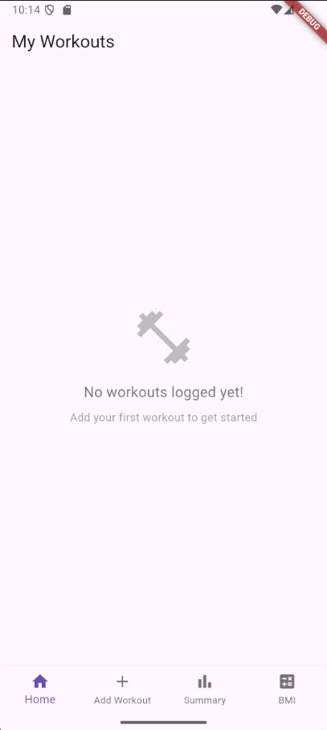
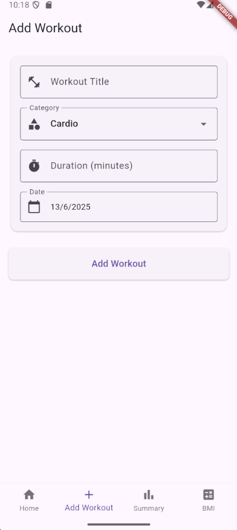
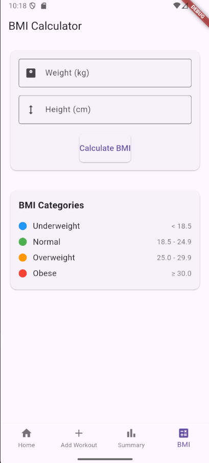
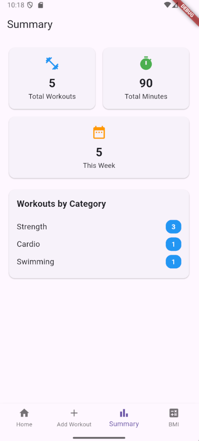

# 🏋️‍♀️ FitTracker - Personal Fitness Activity Logger

[](https://flutter.dev)
[](https://dart.dev)
[](https://opensource.org/licenses/MIT)

> A simple yet powerful mobile application designed to help users track their daily fitness activities, log workouts by category, and monitor their fitness progress with intuitive visualizations.

## 📱 Screenshots

<div align="center">
  
  
  
  
</div>

## ✨ Features

### 🎯 Core Functionality
- **📝 Workout Logging** - Effortlessly log workouts with title, category, duration, and date
- **📱 Workout Management** - View all logged activities in a clean, scrollable interface
- **📊 Activity Summary** - Track workout counts by category with visual insights
- **⚖️ BMI Calculator** - Calculate and monitor Body Mass Index with health status indicators

### 🏃‍♂️ Workout Categories
- 💪 **Strength Training** - Weight lifting, resistance exercises
- ❤️ **Cardio** - Running, cycling, swimming
- 🧘‍♀️ **Yoga** - Flexibility and mindfulness practices
- 🏃‍♀️ **General Fitness** - Mixed activities and sports

## 🚀 Getting Started

### Prerequisites
- Flutter SDK (>= 3.0.0)
- Dart SDK (>= 2.17.0)
- Android Studio / VS Code with Flutter extensions
- Android device or emulator

### Installation

1. **Clone the repository**
   ```bash
   git clone https://github.com/tyagidipanshu098/TechMahindra_final_Assessment.git
   cd TechMahindra_final_Assessment
   ```

2. **Install dependencies**
   ```bash
   flutter pub get
   ```

3. **Run the application**
   ```bash
   flutter run
   ```

## 🏗️ Project Structure

```
lib/
├── main.dart                 # App entry point
├── models/
│   ├── workout.dart         # Workout data model
├── screens/
│   ├── main_screen.dart     # Main workout list view
    ├── home_page.dart  # Home page
│   ├── add_workout_page.dart  # Workout entry form
│   ├── bmi_page.dart      # BMI calculator interface
│   └── summary_page.dart  # Activity statistics
├── services/
│   ├── storage_services.dart   # Stores data locally
└── utils/
    └── category_utils.dart  # Local data persistence
```

## 📋 Functional Requirements

| ID | Requirement | Status |
|----|-------------|--------|
| FR1 | Add new workout entries with complete details | ✅ |
| FR2 | View comprehensive list of logged workouts | ✅ |
| FR3 | Display workout duration and category information | ✅ |
| FR4 | Calculate BMI with health status indicators | ✅ |
| FR5 | Summary statistics by workout category | ✅ |

## 🎨 User Interface

### 📄 Application Pages

#### 🏠 **Home Screen**
- Clean, scrollable list of all workout entries
- Category-based color coding and icons
- Quick access to add new workouts
- Swipe gestures for enhanced navigation

#### ➕ **Add Workout Screen**
- Intuitive form interface with validation
- **Fields:**
  - 📝 Workout Title (e.g., "Morning Push-ups")
  - 🏷️ Category (Cardio, Strength, Yoga, General)
  - ⏱️ Duration (in minutes)
  - 📅 Date picker with default to today

#### ⚖️ **BMI Calculator Screen**
- Simple input fields for weight (kg) and height (cm)
- Real-time BMI calculation
- Health status indicators:
  - 🔵 Underweight (< 18.5)
  - 🟢 Normal (18.5 - 24.9)
  - 🟡 Overweight (25 - 29.9)
  - 🔴 Obese (≥ 30)

#### 📊 **Summary Screen** (Optional)
- Visual breakdown of workouts by category
- Weekly/monthly activity counts
- Progress tracking with simple charts

## 🛠️ Technical Stack

- **Frontend:** Flutter (Cross-platform mobile development)
- **Language:** Dart
- **State Management:** Provider / setState (configurable)
- **Local Storage:** SharedPreferences for data persistence
- **UI Components:** Material Design widgets
- **Charts:** FL Chart for data visualization (optional)

## 📦 Dependencies

```yaml
dependencies:
  flutter:
    sdk: flutter
  provider: ^6.0.5
  shared_preferences: ^2.2.2
  intl: ^0.18.1
  fl_chart: ^0.64.0  # For summary charts (optional)
```

## 🏃‍♂️ Usage

1. **Adding Workouts:**
   - Tap the "+" button on the home screen
   - Fill in workout details (title, category, duration, date)
   - Save to add to your workout log

2. **Viewing Activity:**
   - Browse your workout history on the home screen
   - Each card displays key workout information
   - Tap on entries for detailed view (future enhancement)

3. **BMI Tracking:**
   - Navigate to BMI calculator
   - Enter weight and height
   - View calculated BMI with health status

4. **Progress Monitoring:**
   - Check summary screen for category breakdowns
   - Track weekly/monthly activity trends

## 🎯 Future Enhancements

- 📈 Advanced analytics and progress charts
- 🏆 Achievement badges and milestones
- 📱 Workout reminders and notifications
- 🔄 Data export/import functionality
- 👥 Social sharing capabilities
- 🎵 Integration with music/timer apps

## 🤝 Contributing

1. Fork the repository
2. Create your feature branch (`git checkout -b feature/AmazingFeature`)
3. Commit your changes (`git commit -m 'Add some AmazingFeature'`)
4. Push to the branch (`git push origin feature/AmazingFeature`)
5. Open a Pull Request

## 📝 License

This project is licensed under the MIT License - see the [LICENSE](LICENSE) file for details.

## 🙏 Acknowledgments

- Flutter team for the amazing framework
- Material Design for UI inspiration
- Fitness community for feature suggestions

## 📧 Contact

**Developer:** Divyansh tyagi  
**Email:** tyagidipanshu098@gmail.com
**Project Link:** [https://github.com/yourusername/fittracker](https://github.com/tyagidipanshu098/TechMahindra_Final_Assessment)

---

⭐ **Star this repository if you found it helpful!** ⭐
